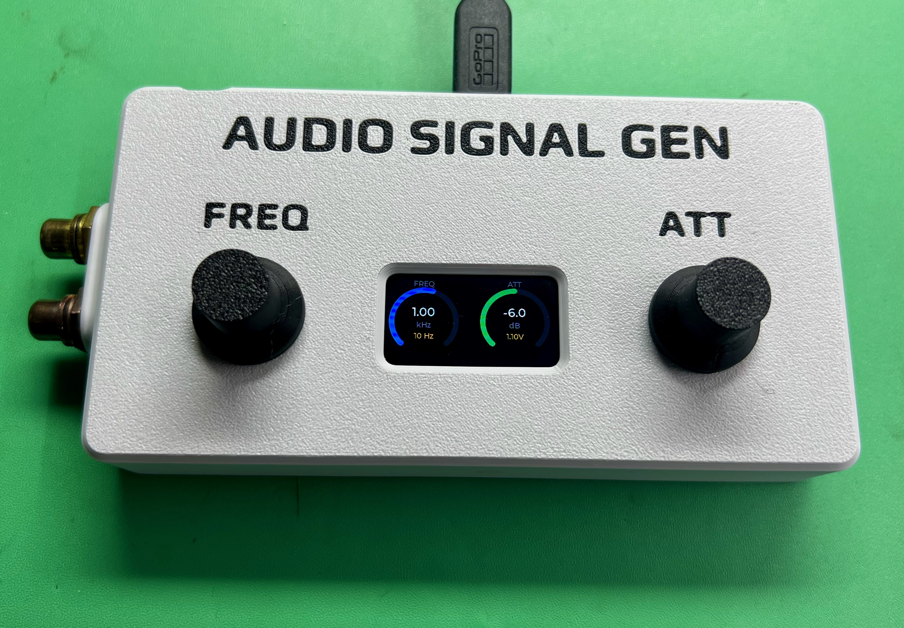
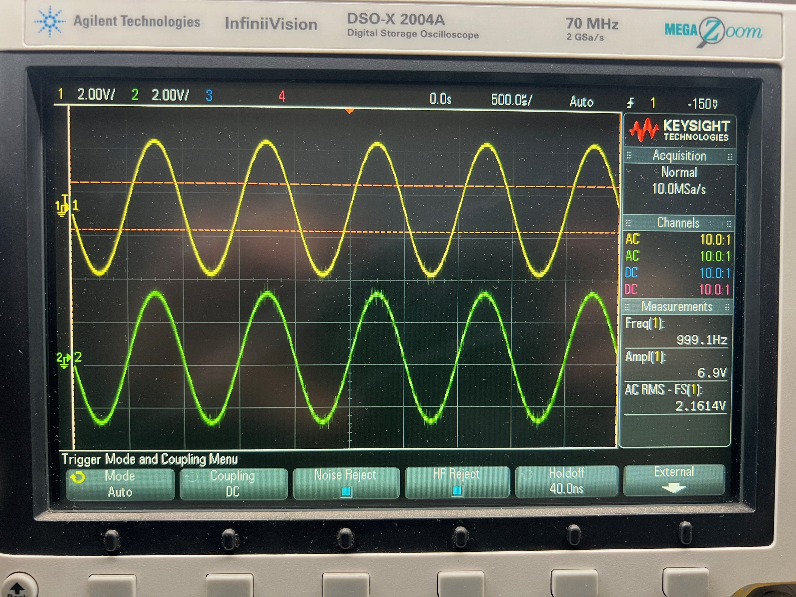

# Audio Signal Generator

A compact bench signal generator built around the Waveshare RP2040-Zero, PCM5102A I2S DAC, and ST7789V3 display. Generates a clean sine wave from 20Hz to 20kHz with adjustable amplitude, displayed on a dual-arc LVGL interface. Designed to live on a study desk rather than take up rack space.



---

## Features

- **20Hz – 20kHz** sine wave output, confirmed flat response on scope
- **Adjustable amplitude** with real-time dB and calibrated Vrms display
- **Channel routing** — ALL, LEFT only, RIGHT only, MUTE (cycled via encoder button)
- **Frequency step cycling** — 1Hz / 10Hz / 100Hz (cycled via encoder button)
- **Dual-arc LVGL UI** on a 320×172 IPS display
  - Blue arc: frequency (logarithmic scale)
  - Green arc: attenuation (linear, tracks encoder directly)
- **I2S output** at 48kHz / 32-bit stereo via PCM5102A DAC
- **Si5351A MCLK reserved** — I2C pins allocated for future DSP slave project

---

## Hardware

| Component | Details |
|-----------|---------|
| MCU | Waveshare RP2040-Zero |
| DAC | PCM5102A breakout (I2S, no MCLK required) |
| Display | ST7789V3 172×320 IPS, 4-wire SPI |
| Controls | 2× rotary encoders with push buttons |
| Future | Si5351A I2C clock generator (unpopulated, pins reserved) |

---

## Pin Assignment

| GPIO | Function |
|------|----------|
| GP0  | Display RST |
| GP1  | Display BLK (PWM backlight) |
| GP3  | Freq encoder A |
| GP4  | Freq encoder B |
| GP5  | Freq encoder SW |
| GP6  | Amp encoder A |
| GP7  | Amp encoder B |
| GP8  | Amp encoder SW |
| GP9  | Display CS |
| GP10 | I2S DATA |
| GP11 | I2S BCK |
| GP12 | I2S LRCK |
| GP13 | Display DC |
| GP14 | Si5351 SDA (I2C1) — reserved, unpopulated |
| GP15 | Si5351 SCL (I2C1) — reserved, unpopulated |
| GP16 | WS2812 RGB LED — board reserved |
| GP26 | Display SCK (SPI1, labelled SCL on breakout) |
| GP27 | Display MOSI (SPI1, labelled SDA on breakout) |

> **Note:** GP17–GP25 are bottom pads only on the RP2040-Zero and are not suitable for breakout pins. The display is therefore on SPI1 (GP26/GP27) rather than the default SPI0 pins.

---

## Controls

| Control | Action |
|---------|--------|
| Freq encoder rotate | Adjust frequency |
| Freq encoder short press | Cycle step size: 1Hz → 10Hz → 100Hz |
| Amp encoder rotate | Adjust amplitude |
| Amp encoder short press | Cycle channel: ALL → LEFT → RIGHT → MUTE → ALL |

---

## Output Level

Full scale (100% amplitude) measures **2.2Vrms** at 1kHz into a high-impedance load, confirmed flat across 20Hz–20kHz. The display shows the calibrated Vrms value in real time. No output padding or digital attenuation has been applied — the PCM5102A output stage is used directly.

The `FULL_SCALE_VRMS` constant in `src/ui/ui.c` can be updated if recalibration is needed.



---

## Project Structure

```
signal_gen/
├── CMakeLists.txt          — root build, executable definition
├── lv_conf.h               — LVGL v8 configuration
├── pico_sdk_import.cmake
├── lib/
│   └── lvgl/               — LVGL v8.3 (git submodule)
└── src/
    ├── CMakeLists.txt
    ├── main.c              — entry point, clock setup, core launch
    ├── config.h            — all pin assignments and project constants
    ├── encoder/            — multi-instance rotary encoder driver
    ├── i2s/                — PIO I2S TX driver + DMA ping-pong
    ├── audio/              — sine LUT, phase accumulator, channel routing
    ├── display/            — ST7789V3 SPI driver, LVGL flush callback
    └── ui/                 — LVGL screen layout, encoder handling
```

---

## Architecture

```
Core 0                          Core 1
──────────────────────          ──────────────────────
audio_engine_init()             ui_init()
  └─ i2s_init()                   ├─ st7789_init()
       └─ PIO + DMA setup          └─ lv_init() + screen

audio_engine_run()              ui_run()
  └─ tight_loop_contents()        ├─ encoder polling
                                  ├─ display refresh
DMA IRQ (Core 0)                  └─ lv_task_handler()
  └─ _fill_buffer()
       ├─ phase accumulator
       ├─ sine LUT lookup
       ├─ amplitude scale (Q15)
       └─ channel routing
```

Cross-core shared state (`freq_hz`, `amplitude`, `channel`) is protected by a Pico SDK `spin_lock_t`. The audio engine snapshots parameters once per DMA buffer fill (~5.3ms), keeping the hot path clean.

---

## Building

### Prerequisites

- [Raspberry Pi Pico SDK](https://github.com/raspberrypi/pico-sdk) with `PICO_SDK_PATH` set
- VS Code with the [Raspberry Pi Pico extension](https://marketplace.visualstudio.com/items?itemName=raspberry-pi.raspberry-pi-pico)
- CMake ≥ 3.13, Ninja, arm-none-eabi-gcc

### Setup

```bash
git clone https://github.com/gbyleveldt/signal_gen.git
cd signal_gen

# Initialise git (required before adding submodules)
git init

# Add LVGL v8 as a submodule
git submodule add https://github.com/lvgl/lvgl.git lib/lvgl
cd lib/lvgl && git checkout release/v8.3 && cd ../..

# Copy pico_sdk_import.cmake from your SDK installation
cp $PICO_SDK_PATH/external/pico_sdk_import.cmake .
```

### Build

Open in VS Code and use the Pico extension to configure and build, or from the terminal:

```bash
mkdir build && cd build
cmake ..
ninja
```

Flash `build/signal_gen.uf2` to the RP2040-Zero (hold BOOT, plug USB, drag file).

> **VS Code one-click flash:** The Run Project task in `.vscode/tasks.json` uses picotool to reboot and flash automatically over USB without touching the BOOT button.

---

## Known Quirks and Notes

| Item | Detail |
|------|--------|
| LVGL `custom.cmake` | Examples and demos must be manually commented out in `lib/lvgl/env_support/cmake/custom.cmake` — the `LV_BUILD_EXAMPLES OFF` cache flag is not honoured in v8.3 |
| ST7789 Y offset | The controller has a 240×320 internal framebuffer; the 172-pixel panel requires a 34px Y offset applied in `_set_window()` |
| LV_COLOR_16_SWAP | Must be 1 for correct colours over SPI on this display |
| SPI instance | Display uses `spi1` (GP26/GP27), not `spi0` |
| System clock | Set to 122.88MHz for an exact integer PIO divider for 48kHz I2S. Falls back gracefully if the PLL cannot achieve it exactly |
| Si5351A | I2C1 reserved at GP14/GP15 for future MCLK generation. When the DSP slave project requires it, populate the Si5351A and implement synchronised clock generation |

---

## Future Work

- [ ] Si5351A MCLK output (12.288MHz) for DSP slave project
- [ ] Additional waveforms (square, triangle)
- [ ] Frequency arc display refinement based on real-world use
- [ ] Output stage evaluation (op-amp buffer for lower output impedance)

---

## Built With Claude

This project was developed collaboratively with [Claude](https://claude.ai) (Anthropic). Claude contributed to the software architecture, PIO I2S implementation, LVGL integration, encoder driver design, and debugging throughout the bring-up process — from initial hardware selection through to final UI design and GitHub publication.

All commits made directly by Claude include the following co-author tag:
```
Co-authored-by: Claude (Anthropic) <claude@anthropic.com>
```

---

## Licence

MIT
